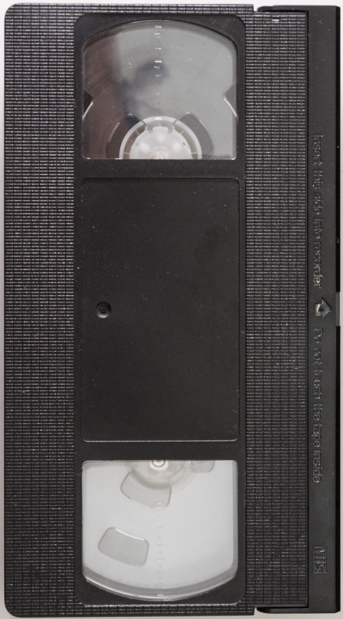

# Phase 1 Study Hall Project

This is an *optional* project to prepare you for the phase 1 code challenge. You'll be building this project over the course of several days in addition to labs, readings, and lectures.

You can work alone or in small groups.

## Getting Started

Fork and clone this repository. Open it in your IDE as well as your browser (for example `code .` and `open index.html`).

You'll be writing your code in the `src/index.js` file however you can add any additional files as you see fit. Be sure to look at the `index.html` file so you feel familiar with the initial HTML. You may edit `index.html` and `style.css` as you see fit.

## JSON-Server

In order to fetch the required information, you'll need to start your `json-server`. First make sure that `json-server` is installed. You can do this with `npm install -g json-server` (you may have already done this for a lab in which case it's already installed). When you're ready, run `json-server --watch db.json` in your terminal.

When fetching information you can use this endpoint:

```
http://localhost:3000/drinks
```

Later on you'll be asked to make a POST and a DELETE request. For the POST request you can use these options:

```js
{
    method: 'POST',
    headers: {
        'Content-Type': 'application/json',
    },
    body: ???
}
```

## Day One Deliverables

You're building a website for a VHS rental store! They've provided you with the information you'll need in a `db.json` file as well as some rudimentary styling and a basic `index.html`. Your first tasks are this:

Firstly, delete the `div`s and their contents with a class of `vhs-card`. These are meant to be examples of what the final product might look like.

Make a fetch request to get all the VHS cassettes. **For each** VHS cassette, create a new element and display it in the `.vhs-container` in a card like this:

```html
<div class="vhs-card">
    <h2>Title of Movie</h2>
    
    <p>Rental Price: rental price of movie</p>
</div>
```

Be sure to replace the appropriate text with the proper information! This includes the `alt` text!

### Bonus Deliverables: Styling

Feel free to add additional styling to this page such as a background image, make the banner more exciting, or make the movie card more interesting. I strongly suggest adding a flexbox so that cards will line up next to each other!

### Bonus Deliverables: Technical

If a vhs rental doesn't have an image associated with it, show the vhs tape image instead. The `img` tag you create might look something like this:

```html

```

Additionally, before adding the cards to the DOM, sort the array of rental videos alphabetically by title. Be sure to look up examples and documentation!

## Day Two Deliverables

Add a new form to the HTML above the `vhs-container`. The form should have inputs for the movie title, movie image url, and the price. For an additional challenge, make the price a select tag with options `$`, `$$`, and `$$$`.

When the form is submitted, add the new VHS entry to the DOM. Additionally, create a POST request to your `json-server` to persist the VHS tape so it will remain on refresh.

### Bonus Deliverables: Styling

The form should be nicely styled. Additionally, go to google fonts and research how to add new font families to the project!

### Bonus Deliverables: Technical

The form should not accept blank inputs (you shouldn't be able to create a movie with a blank title).

Additionally, create a DELETE button that removes it from both the front end DOM and the back end `json-server`.
